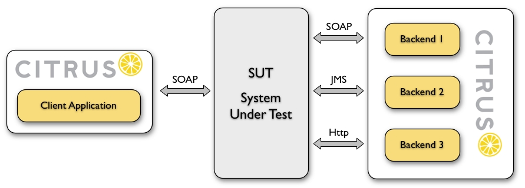

## Introduction

Nowadays enterprise applications usually communicate with different partners over loosely coupled messaging interfaces. The interaction and the interface contract needs to be tested in integration testing.

In a typical integration test scenario we need to simulate the communication partners over various transports. How can we test use case scenarios that include several interface partners interacting with each other? How can somebody ensure that the software components work correctly regarding the interface contract? How can somebody run integration test cases in an automated reproducible way? Citrus tries to answer these questions!

### Overview

Citrus aims to strongly support you in simulating interface partners across different messaging transports. You can easily produce and consume messages with a wide range of protocols like HTTP, JMS, TCP/IP, FTP, SMTP and more. The framework is able to both act as a client and server. In each communication step Citrus is able to validate message contents towards syntax and semantics.

In addition to that the Citrus offers a wide range of test actions to take control of the process flow during a test (e.g. iterations, system availability checks, database connectivity, parallelism, delaying, error simulation, scripting and many more).

The basic goal in Citrus test cases is to describe a whole use case scenario including several interface partners that exchange many messages with each other. The composition of complex message flows in a single test case with several test steps is one of the major features in Citrus.

The test case description is either done in XML or Java and can be executed multiple times as automated integration test. With JUnit and TestNG integration Citrus can easily be integrated into your build lifecycle process. During a test Citrus simulates all surrounding interface partners (client or server) without any coding effort. With easy definition of expected message content (header and payload) for XML, CSV, SOAP, JSON or plaintext messages Citrus is able to validate the incoming data towards syntax and semantics.

### Usage scenarios

If you are in charge of an enterprise application in a message based solution with message interfaces to other software components you should use Citrus. In case your project interacts with other software over different messaging transports and in case you need to simulate these interface partners on client or server side you should use Citrus. In case you need to continuously check the software stability not only on a unit testing basis but also in an end-to-end integration scenario you should use Citrus. Bug fixing, release or regression testing is very easy with Citrus. In case you are struggling with code stability and feel uncomfortable regarding your next software release you should definitely use Citrus.

This test set up is typical for a Citrus use case. In such a test scenario we have a system under test (SUT) with several message interfaces to other applications like you would have with an enterprise service bus for instance. A client application invokes services on the SUT application. The SUT is linked to several backend applications over various messaging transports (here SOAP, JMS, and Http). Interim message notifications and final responses are sent back to the client application. This generates a bunch of messages that are exchanged throughout the applications involved.

In the automated integration test Citrus needs to send and receive those messages over different transports. Citrus takes care of all interface partners (ClientApplication, Backend1, Backend2, Backend3) and simulates their behavior by sending proper response messages in order to keep the message flow alive.

Each communication step comes with message validation and comparison against an expected message template (e.g. XML or JSON data). Besides messaging actions Citrus is also able to perform arbitrary other test actions. Citrus is able to perform a database query between requests as an example.

The Citrus test case runs fully automated as a Java application. In fact a Citrus test case is nothing but a JUnit or TestNG test case. Step by step the whole use case scenario is performed like in a real production environment. The Citrus test is repeatable and is included into the software build process (e.g. using Maven or ANT) like a normal unit test case would do. This gives you fully automated integration tests to ensure interface stability.

The following reference guide walks through all Citrus capabilities and shows how to set up a great integration test with Citrus.

