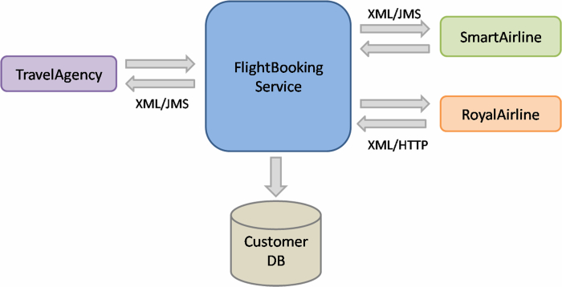
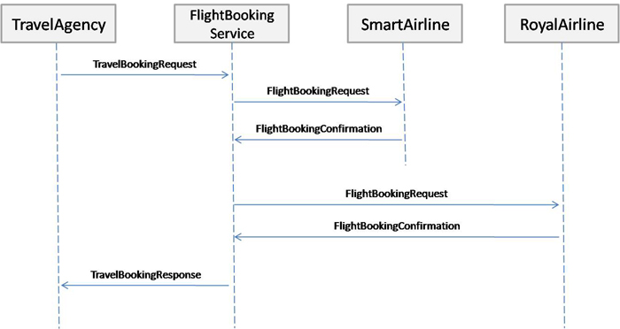

### The FlightBooking sample

A simple project example should give you the idea how Citrus works. The system under test is a flight booking service that handles travel requests from a travel agency. A travel request consists of a complete travel route including several flights. The FlightBookingService application will split the complete travel booking into separate flight bookings that are sent to the respective airlines in charge. The booking and customer data is persisted in a database.

The airlines will confirm or deny the flight bookings. The FlightBookingService application consolidates all incoming flight confirmations and combines them to a complete travel confirmation or denial that is sent back to the travel agency. Next picture tries to put the architecture into graphics:




In our example two different airlines are connected to the FlightBookingService application: the SmartAriline over JMS and the RoyalAirline over Http.

### The use case

The use case that we would like to test is quite simple. The test should handle a simple travel booking and expect a positive processing to the end. The test case neither simulates business errors nor technical problems. Next picture shows the use case as a sequence diagram.




The travel agency puts a travel booking request towards the system. The travel booking contains two separate flights. The flight requests are published to the airlines (SmartAirline and RoyalAirline). Both airlines confirm the flight bookings with a positive answer. The consolidated travel booking response is then sent back to the travel agency.

### Configure the simulated systems

Citrus simulates all surrounding applications in their behavior during the test. The simulated applications are: TravelAgency, SmartAirline and RoyalAirline. The simulated systems have to be configured in the Citrus configuration first. The configuration is done in Spring XML configuration files, as Citrus uses Spring to glue all its services together.

First of all we have a look at the TravelAgency configuration. The TravelAgency is using JMS to connect to our tested system, so we need to configure this JMS connection in Citrus.

```xml
<bean name="connectionFactory" 
         class="org.apache.activemq.ActiveMQConnectionFactory">
    <property name="brokerURL" value="tcp://localhost:61616" />
</bean>

<citrus-jms:endpoint id="travelAgencyBookingRequestEndpoint"
                      destination-name="${travel.agency.request.queue}"/>

<citrus-jms:endpoint id="travelAgencyBookingResponseEndpoint"
                      destination-name="${travel.agency.response.queue}"/>
```

This is all Citrus needs to send and receive messages over JMS in order to simulate the TravelAgency. By default all JMS message senders and receivers need a connection factory. Therefore Citrus is searching for a bean named "connectionFactory". In the example we connect to a ActiveMQ message broker. A connection to other JMS brokers like TIBCO EMS or Apache ActiveMQ is possible too by simply changing the connection factory implementation.

The identifiers of the message senders and receivers are very important. We should think of suitable ids that give the reader a first hint what the sender/receiver is used for. As we want to simulate the TravelAgency in combination with sending booking requests our id is "travelAgencyBookingRequestEndpoint" for example.

The sender and receivers do also need a JMS destination. Here the destination names are provided by property expressions. The Spring IoC container resolves the properties for us. All we need to do is publish the property file to the Spring container like this.

```xml
<bean name="propertyLoader" 
   class="org.springframework.beans.factory.config.PropertyPlaceholderConfigurer">
    <property name="locations">
        <list>
            <value>citrus.properties</value>
        </list>
    </property>
    <property name="ignoreUnresolvablePlaceholders" value="true"/>
</bean>
```

The citrus.properties file is located in our project's resources folder and defines the actual queue names besides other properties of course:

```xml
#JMS queues
travel.agency.request.queue=Travel.Agency.Request.Queue
travel.agency.response.queue=Travel.Agency.Response.Queue
smart.airline.request.queue=Smart.Airline.Request.Queue
smart.airline.response.queue=Smart.Airline.Response.Queue
royal.airline.request.queue=Royal.Airline.Request.Queue
```

What else do we need in our Spring configuration? There are some basic beans that are commonly defined in a Citrus application but I do not want to bore you with these details. So if you want to have a look at the Spring application context file in the resources folder and see how things are defined there.

We continue with the first airline to be configured the SmartAirline. The SmartAirline is also using JMS to communicate with the FlightBookingService. So there is nothing new for us, we simply define additional JMS message senders and receivers.

```xml
<citrus-jms:endpoint id="smartAirlineBookingRequestEndpoint"
                      destination-name="${smart.airline.request.queue}"/>

<citrus-jms:endpoint id="smartAirlineBookingResponseEndpoint"
                      destination-name="${smart.airline.response.queue}"/>
```

We do not define a new JMS connection factory because TravelAgency and SmartAirline are using the same message broker instance. In case you need to handle multiple connection factories simply define the connection factory with the attribute "connection-factory".

```xml
<citrus-jms:endpoint id="smartAirlineBookingRequestEndpoint"
                            destination-name="${smart.airline.request.queue}"
                            connection-factory="smartAirlineConnectionFactory"/>

<citrus-jms:endpoint id="smartAirlineBookingResponseEndpoint"
                          destination-name="${smart.airline.response.queue}"
                          connection-factory="smartAirlineConnectionFactory"/>
```

### Configure the Http adapter

The RoyalAirline is connected to our system using Http request/response communication. This means we have to simulate a Http server in the test that accepts client requests and provides proper responses. Citrus offers a Http server implementation that will listen on a port for client requests. The adapter forwards incoming request to the test engine over JMS and receives a proper response that is forwarded as a Http response to the client. The next picture shows this mechanism in detail.


The RoyalAirline adapter receives client requests over Http and sends them over JMS to a message receiver as we already know it. The test engine validates the received request and provides a proper response back to the adapter. The adapter will transform the response to Http again and publishes it to the calling client. Citrus offers these kind of adapters for Http and SOAP communication. By writing your own adapters like this you will be able to extend Citrus so it works with protocols that are not supported yet.

Let us define the Http adapter in the Spring configuration:

```xml
<citrus-http:server id="royalAirlineHttpServer" 
                       port="8091" 
                       uri="/flightbooking" 
                       endpoint-adapter="jmsEndpointAdapter"/>
        
<citrus-jms:endpoint-adapter id="jmsEndpointAdapter
      destination-name="${royal.airline.request.queue}"/>
      connection-factory="connectionFactory" />
      timeout="2000"/>

<citrus-jms:sync-endpoint id="royalAirlineBookingEndpoint"
                            destination-name="${royal.airline.request.queue}"/>
```

We need to configure a Http server instance with a port, a request URI and the endpoint adapter. We define the JMS endpoint adapter to handle request as described. In Addition to the endpoint adapter we also need synchronous JMS message sender and receiver instances. That's it! We are able to receive Http request in order to simulate the RoyalAirline application. What is missing now? The test case definition itself.

### The test case

The test case definition is also a Spring configuration file. Citrus offers a customized XML syntax to define a test case. This XML test defining language is supposed to be easy to understand and more specific to the domain we are dealing with. Next listing shows the whole test case definition. Keep in mind that a test case defines every step in the use case. So we define sending and receiving actions of the use case as described in the sequence diagram we saw earlier.

```xml
<?xml version="1.0" encoding="UTF-8"?>
<spring:beans xmlns="http://www.citrusframework.org/schema/testcase" 
             xmlns:spring="http://www.springframework.org/schema/beans" 
             xmlns:xsi="http://www.w3.org/2001/XMLSchema-instance" 
             xsi:schemaLocation="http://www.springframework.org/schema/beans 
             http://www.springframework.org/schema/beans/spring-beans.xsd 
             http://www.citrusframework.org/schema/testcase 
             http://www.citrusframework.org/schema/testcase/citrus-testcase.xsd">
    <testcase name="FlightBookingTest">
        <meta-info>
            <author>Christoph Deppisch</author>
            <creationdate>2009-04-15</creationdate>
            <status>FINAL</status>
            <last-updated-by>Christoph Deppisch</last-updated-by>
            <last-updated-on>2009-04-15T00:00:00</last-updated-on>
        </meta-info>
        <description>
            Test flight booking service.
        </description>
        <variables>
            <variable name="correlationId" 
                value="citrus:concat('Lx1x', 'citrus:randomNumber(10)')"/>
            <variable name="customerId" 
                value="citrus:concat('Mx1x', citrus:randomNumber(10))"/>
        </variables>
        <actions>
            <send endpoint="travelAgencyBookingRequestEndpoint">
                <message>
                    <data>
                      <![CDATA[
                        <TravelBookingRequestMessage 
                          xmlns="http://www.consol.com/schemas/TravelAgency">
                          <correlationId>${correlationId}</correlationId>
                          <customer>
                            <id>${customerId}</id>
                            <firstname>John</firstname>
                            <lastname>Doe</lastname>
                          </customer>
                          <flights>
                            <flight>
                              <flightId>SM 1269</flightId>
                              <airline>SmartAirline</airline>
                              <fromAirport>MUC</fromAirport>
                              <toAirport>FRA</toAirport>
                              <date>2009-04-15</date>
                              <scheduledDeparture>11:55:00</scheduledDeparture>
                              <scheduledArrival>13:00:00</scheduledArrival>
                            </flight>
                            <flight>
                              <flightId>RA 1780</flightId>
                              <airline>RoyalAirline</airline>
                              <fromAirport>FRA</fromAirport>
                              <toAirport>HAM</toAirport>
                              <date>2009-04-15</date>
                              <scheduledDeparture>16:00:00</scheduledDeparture>
                              <scheduledArrival>17:10:00</scheduledArrival>
                            </flight>
                          </flights>                                
                        </TravelBookingRequestMessage>
                      ]]>
                    </data>
                </message>
                <header>
                    <element name="correlationId" value="${correlationId}"/>
                </header>
            </send>
            
            <receive endpoint="smartAirlineBookingRequestEndpoint">
                <message>
                    <data>
                      <![CDATA[
                        <FlightBookingRequestMessage 
                          xmlns="http://www.consol.com/schemas/AirlineSchema">
                          <correlationId>${correlationId}</correlationId>
                          <bookingId>???</bookingId>
                          <customer>
                            <id>${customerId}</id>
                            <firstname>John</firstname>
                            <lastname>Doe</lastname>
                          </customer>
                          <flight>
                            <flightId>SM 1269</flightId>
                            <airline>SmartAirline</airline>
                            <fromAirport>MUC</fromAirport>
                            <toAirport>FRA</toAirport>
                            <date>2009-04-15</date>
                            <scheduledDeparture>11:55:00</scheduledDeparture>
                            <scheduledArrival>13:00:00</scheduledArrival>
                          </flight>
                        </FlightBookingRequestMessage>
                      ]]>
                    </data>
                    <ignore path="//:FlightBookingRequestMessage/:bookingId"/>
                </message>
                <header>
                    <element name="correlationId" value="${correlationId}"/>
                </header>
                <extract>
                    <message path="//:FlightBookingRequestMessage/:bookingId" 
                                variable="${smartAirlineBookingId}"/>
                </extract>
            </receive>
            
            <send endpoint="smartAirlineBookingResponseEndpoint">
                <message>
                    <data>
                      <![CDATA[
                        <FlightBookingConfirmationMessage 
                          xmlns="http://www.consol.com/schemas/AirlineSchema">
                          <correlationId>${correlationId}</correlationId>
                          <bookingId>${smartAirlineBookingId}</bookingId>
                          <success>true</success>
                          <flight>
                            <flightId>SM 1269</flightId>
                            <airline>SmartAirline</airline>
                            <fromAirport>MUC</fromAirport>
                            <toAirport>FRA</toAirport>
                            <date>2009-04-15</date>
                            <scheduledDeparture>11:55:00</scheduledDeparture>
                            <scheduledArrival>13:00:00</scheduledArrival>
                          </flight>
                        </FlightBookingConfirmationMessage>
                      ]]>
                    </data>
                </message>
                <header>
                    <element name="correlationId" value="${correlationId}"/>
                </header>
            </send>
            
            <receive endpoint="royalAirlineBookingEndpoint">
                <message>
                    <data>
                      <![CDATA[
                        <FlightBookingRequestMessage 
                          xmlns="http://www.consol.com/schemas/FlightBooking/AirlineSchema">
                          <correlationId>${correlationId}</correlationId>
                          <bookingId>???</bookingId>
                          <customer>
                              <id>${customerId}</id>
                              <firstname>John</firstname>
                              <lastname>Doe</lastname>
                          </customer>
                          <flight>
                            <flightId>RA 1780</flightId>
                            <airline>RoyalAirline</airline>
                            <fromAirport>FRA</fromAirport>
                            <toAirport>HAM</toAirport>
                            <date>2009-04-15</date>
                            <scheduledDeparture>16:00:00</scheduledDeparture>
                            <scheduledArrival>17:10:00</scheduledArrival>
                          </flight>
                        </FlightBookingRequestMessage>
                      ]]>
                    </data>
                    <ignore path="//:FlightBookingRequestMessage/:bookingId"/>
                </message>
                <header>
                    <element name="correlationId" value="${correlationId}"/>
                </header>
                <extract>
                    <message path="//:FlightBookingRequestMessage/:bookingId" 
                                variable="${royalAirlineBookingId}"/>
                </extract>
            </receive>
            
            <send endpoint="royalAirlineBookingEndpoint">
                <message>
                    <data>
                      <![CDATA[
                        <FlightBookingConfirmationMessage 
                          xmlns="http://www.consol.com/schemas/AirlineSchema">
                          <correlationId>${correlationId}</correlationId>
                          <bookingId>${royalAirlineBookingId}</bookingId>
                          <success>true</success>
                          <flight>
                            <flightId>RA 1780</flightId>
                            <airline>RoyalAirline</airline>
                            <fromAirport>FRA</fromAirport>
                            <toAirport>HAM</toAirport>
                            <date>2009-04-15</date>
                            <scheduledDeparture>16:00:00</scheduledDeparture>
                            <scheduledArrival>17:10:00</scheduledArrival>
                          </flight>
                        </FlightBookingConfirmationMessage>
                      ]]>
                    </data>
                </message>
                <header>
                    <element name="correlationid" value="${correlationId}"/>
                </header>
            </send>
            
            <receive endpoint="travelAgencyBookingResponseEndpoint">
                <message>
                    <data>
                      <![CDATA[
                        <TravelBookingResponseMessage 
                          xmlns="http://www.consol.com/schemas/TravelAgency">
                          <correlationId>${correlationId}</correlationId>
                          <success>true</success>
                          <flights>
                            <flight>
                              <flightId>SM 1269</flightId>
                              <airline>SmartAirline</airline>
                              <fromAirport>MUC</fromAirport>
                              <toAirport>FRA</toAirport>
                              <date>2009-04-15</date>
                              <scheduledDeparture>11:55:00</scheduledDeparture>
                              <scheduledArrival>13:00:00</scheduledArrival>
                            </flight>
                            <flight>
                              <flightId>RA 1780</flightId>
                              <airline>RoyalAirline</airline>
                              <fromAirport>FRA</fromAirport>
                              <toAirport>HAM</toAirport>
                              <date>2009-04-15</date>
                              <scheduledDeparture>16:00:00</scheduledDeparture>
                              <scheduledArrival>17:10:00</scheduledArrival>
                            </flight>
                          </flights>                                
                        </TravelBookingResponseMessage>
                      ]]>
                    </data>
                </message>
                <header>
                    <element name="correlationId" value="${correlationId}"/>
                </header>
            </receive>
            
        </actions>
    </testcase>
</spring:beans>
```

Similar to a sequence diagram the test case describes every step of the use case. At the very beginning the test case gets name and its meta information. Following with the variable values that are used all over the test. Here it is the correlationId and the customerId that are used as test variables. Inside message templates header values the variables are referenced several times in the test

 ***<correlationId>${correlationId}</correlationId>*** 

 ***<id>${customerId}</id>*** 

The sending/receiving actions use a previously defined message sender/receiver. This is the link between test case and basic Spring configuration we have done before.

 ***<send endpoint="travelAgencyBookingRequestEndpoint">*** 

The sending action chooses a message sender to actually send the message using a message transport (JMS, Http, SOAP, etc.). After sending this first "TravelBookingRequestMessage" request the test case expects the first "FlightBookingRequestMessage" message on the SmartAirline JMS destination. In case this message is not arriving in time the test will fail with errors. In positive case our FlightBookingService works well and the message arrives in time. The received message is validated against a defined expected message template. Only in case all content validation steps are successful the test continues with the action chain. And so the test case proceeds and works through the use case until every message is sent respectively received and validated. The use case is done automatically without human interaction. Citrus simulates all surrounding applications and provides detailed validation possibilities of messages.

